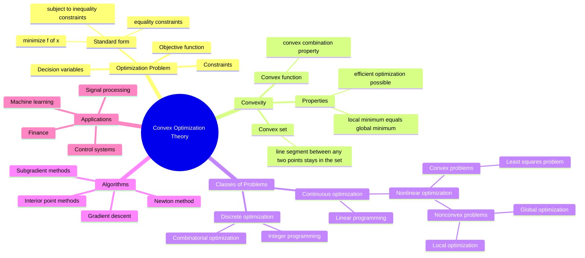

```mermaid

mindmap
  root((Convex Optimization Theory))

    Optimization Problem
      Objective function
      Decision variables
      Constraints
      Standard form
        minimize f of x
        subject to inequality constraints
        equality constraints

    Convexity
      Convex set
        line segment between any two points stays in the set
      Convex function
        convex combination property
      Properties
        local minimum equals global minimum
        efficient optimization possible

    Classes of Problems
      Continuous optimization
        Linear programming
        Nonlinear optimization
          Convex problems
            Least squares problem
          Nonconvex problems
            Local optimization
            Global optimization
      Discrete optimization
        Integer programming
        Combinatorial optimization

    Algorithms
      Gradient descent
      Newton method
      Interior point methods
      Subgradient methods

    Applications
      Machine learning
      Signal processing
      Control systems
      Finance
```