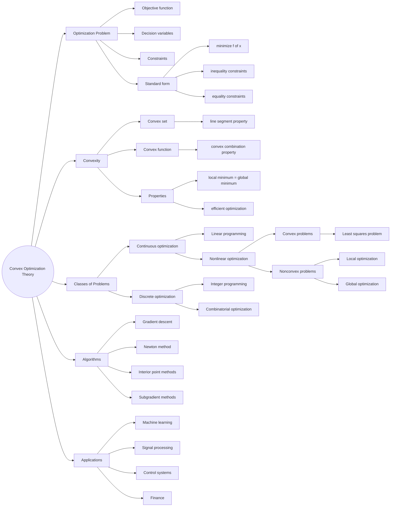

```mermaid
flowchart LR

A((Convex Optimization Theory))

A --> B[Optimization Problem]
A --> C[Convexity]
A --> D[Classes of Problems]
A --> E[Algorithms]
A --> F[Applications]

B --> B1[Objective function]
B --> B2[Decision variables]
B --> B3[Constraints]
B --> B4[Standard form]

B4 --> B41[minimize f of x]
B4 --> B42[inequality constraints]
B4 --> B43[equality constraints]

C --> C1[Convex set]
C --> C2[Convex function]
C --> C3[Properties]

C1 --> C11[line segment property]
C2 --> C21[convex combination property]
C3 --> C31[local minimum = global minimum]
C3 --> C32[efficient optimization]

D --> D1[Continuous optimization]
D --> D2[Discrete optimization]

D1 --> D11[Linear programming]
D1 --> D12[Nonlinear optimization]

D12 --> D121[Convex problems]
D12 --> D122[Nonconvex problems]

D121 --> D1211[Least squares problem]
D122 --> D1221[Local optimization]
D122 --> D1222[Global optimization]

D2 --> D21[Integer programming]
D2 --> D22[Combinatorial optimization]

E --> E1[Gradient descent]
E --> E2[Newton method]
E --> E3[Interior point methods]
E --> E4[Subgradient methods]

F --> F1[Machine learning]
F --> F2[Signal processing]
F --> F3[Control systems]
F --> F4[Finance]
```