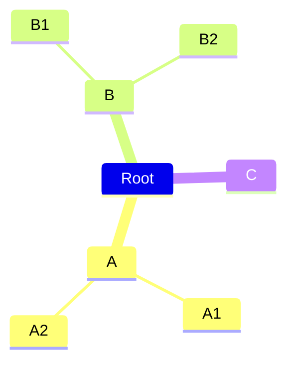
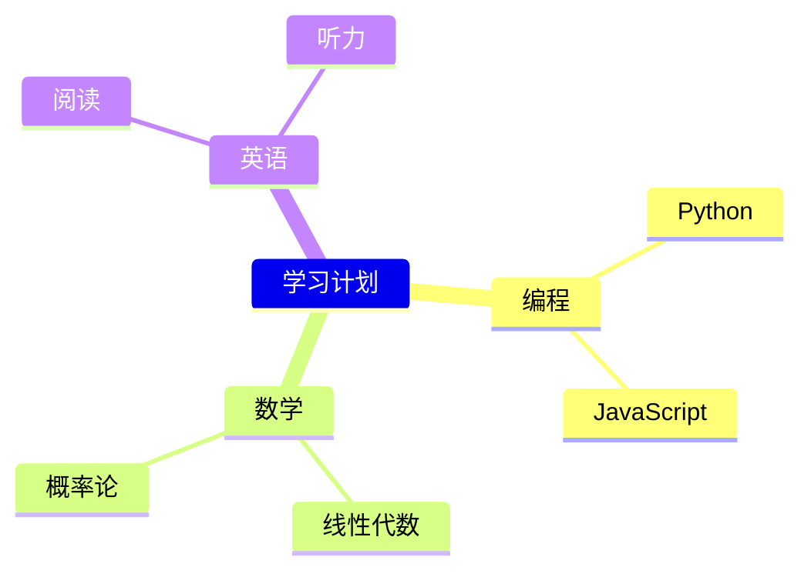
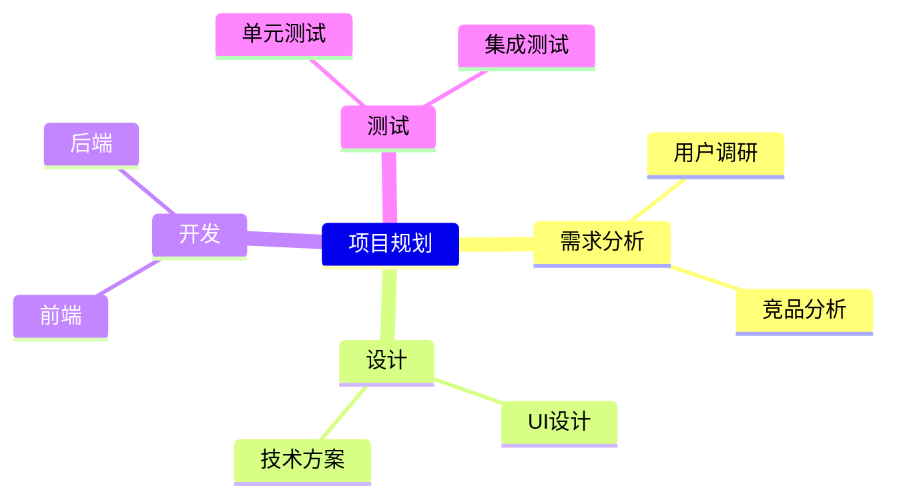

# Mermaid Mindmap 测试

下面是一个思维导图，在 GitHub 上查看此文件时应该会被渲染成图。

## 示例 1：简单层级

```mermaid
mindmap
    Root
        A
            A1
            A2
        B
            B1
            B2
        C
```

## 示例 2：带主题的思维导图

```mermaid
mindmap
    学习计划
        编程
            Python
            JavaScript
        数学
            线性代数
            概率论
        英语
            阅读
            听力
```

## 示例 3：多层级

```mermaid
mindmap
    项目规划
        需求分析
            用户调研
            竞品分析
        设计
            UI设计
            技术方案
        开发
            前端
            后端
        测试
            单元测试
            集成测试
```

---

**使用方式：** 将此文件推送到 GitHub 仓库，在网页上打开此 `.md` 文件即可看到渲染后的思维导图。
